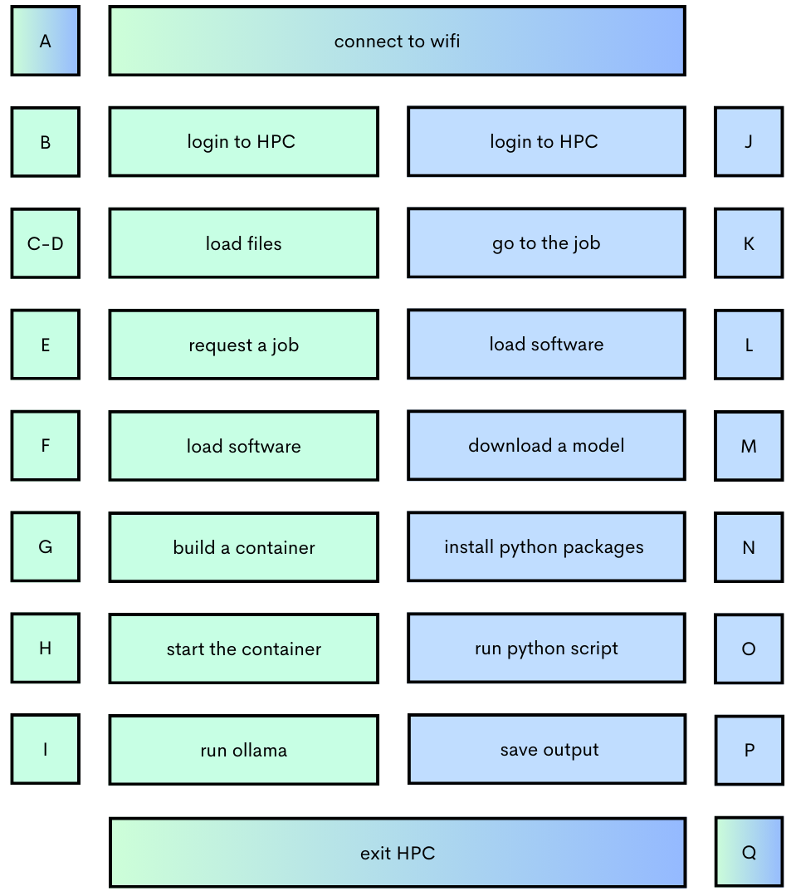
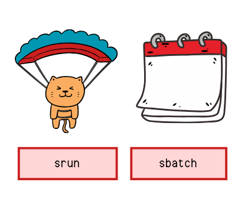

# Llama on UConn Storrs HPC
This repository (repo) is for running Llama models from a Python script in UConn's High Performance Computing (HPC) environment. Two approaches are included in the repo:

1. Ollama downloaded with Apptainer (classify_with_ollama.py)
2. Hugging Face (classify_with_hugging_face.py)

## CRISP Project Summary
The ultimate goal of this repo is to use Approach #1 (above) to prompt Llama 3.3 70B with Project CRISP data, asking the model to classify input across various psychological characteristics e.g., meaning making. Included in the repo is a demo, showing how to use Llama for a classification task within the UConn Storrs HPC environment. 

Llama is a collection of open-source large language models (LLMs) developed by Meta (see more [here](https://www.llama.com)). The two approaches included in the repo are for running the models locally instead of using an API inference endpoint. Running the models locally is free and ensures the input data are contained locally. 

Running these models can be resource intensive depending on the size of the model (i.e., number of parameters - 3B vs 70B) and the approach. Returning output from the same sized model e.g., Llama 3.2 3B is faster using Ollama than Hugging Face. While a personal computer might be sufficient for running smaller models, HPC can be useful for running larger models like Llama 3.3 70B. 

Included in the repo is a demo of how run Llama models on UConn Storrs HPC.

## Demo Summary
The demo (classify_with_ollama.py) prompts Llama 3.2 3B to classify a random sample of 20 Goodreads reviews into a 1-5 rating. These data are sourced from train.csv on [Kaggle.com](https://www.kaggle.com/competitions/goodreads-books-reviews-290312/data). The random sample was generated using goodreads_sample.py. There are two variables of interest in goodreads_20.csv: 
- review_text: the text of the book review
- rating: a rating of the book on a 0 to 5 scale. 

The input data is a combination of a prompt, i.e., the task the model is being asked to perform, and the case, the scenario the model should consider when performing the task. In the demo, the prompt is for the model to assign a rating of the book review on a scale from 0 = bad to 5 = good.


The demo contains Steps A-Q which include how to log in and request a job from UConn Storrs HPC, how to build a container from a Docker image as an option for running software, and how to use langchain_Ollama in Python to prompt models downloaded in the container. These steps are completed in two separate terminal windows. The figure below provides a high level overview of the demo and deliniates the steps completed on each terminal window:



Each subsection provides context for each step as well as direction for how to install the pre-requisites. 
Each step (e.g., __Step A__) assumes the pre-requisites are met.


Some final thoughts: 
- This demo is not intended to replace the UConn Storrs HPC documentation, but supplement with an applied task. I tried to make note of any information I found useful while learning about HPC environments and containerizing applications. 
- If you are new to HPC or containers, I'd recommend testing at a small scale and then building upon these tests. I've included supplemental materials in the container to support this. For example:
    - New to HPC? test_ollama.py contains an even smaller scale demo testing core functionality of running a Llama model on HPC. It prompts the model with, "Hi, how are you?" and outputs a response.
    - New to Docker? docker.sh contains Terminal commands to build the Ollama Docker container using Docker commands. This allows you to build the container locally before using Apptainer on HPC. To build a Docker container.

## Pre-Requisites
The demo assumes the following:
- Personal Device:
    - Mac Operating System (OS)
    - [VS Code](https://code.visualstudio.com) Interactive Development Environment (IDE)
- UConn Account:
    - UConn NetID and Password
    - [Cisco Duo](https://kb.uconn.edu/space/IKB/10789815076/Setting+up+a+Mobile+Phone+for+2FA) Two-Factor Authentication (2FA)
- HPC:
    - [UConn Storrs HPC Account](https://login.uconn.edu/cas/login?service=https%3A%2F%2Fhpc.uconn.edu%2Fwp-login.php%3Fprivacy%3D2%26redirect_to%3Dhttps%253A%252F%252Fhpc.uconn.edu%252Fstorrs%252Faccount-application%252F)
    - [Cisco AnyConnect](https://kb.uconn.edu/space/IKB/10907091023/Set+Up+Cisco+AnyConnect+VPN) Virtual Private Network (VPN)
    - [XQuartz](https://www.xquartz.org) Secure SHell (SSH) Client and X11 Window System
    - [FileZilla]() File Transfer Protocol (FTP)
    - [Docker Account](https://www.docker.com)


### Connect to a VPN
The Cisco AnyConnect VPN allows active staff, faculty, and students access to the UConn network. Computers connected to UConn-Secure WiFi or an on-campus ethernet port do not need to use a VPN. To access the UConn network off campus, install Cisco AnyConnect and follow the set-up instructions [here](https://kb.uconn.edu/space/IKB/10907091023/Set+Up+Cisco+AnyConnect+VPN) (also linked in the pre-requisites section).

* __Step A:__ Open the Cisco Secure Client application. You will be prompted to log in with your NetID and Password. 

### Enable Graphics Forwarding
Displaying program graphics, like rendering a plot, requires an X11 Window System to enable graphics forwarding. Graphics forwarding is how graphics are sent from a remote host (i.e., the HPC cluster) to the local client (i.e., your computer). 

[XQuartz](https://www.xquartz.org) is the X11 Window System for MacOS. The X11 Window System requirements will vary by OS and by computer. Some Windows users may need to install [VcXsrv](https://sourceforge.net/projects/vcxsrv/) while Linux users don't need to install an X11 Window System. For more information, see Step 3 in UConn Storrs HPC's [Getting Started](https://kb.uconn.edu/space/SH/26694811668/Getting+Started) guide. 

### Login to HPC
Login to HPC uses a Secure Shell (SSH) protocol, a method for secure remote login between your computer and HPC. MacOS and Linux OS users can login to HPC using the default Terminal application. 

For Windows OS, [MobaXterm](https://mobaxterm.mobatek.net) is recommended by Storrs HPC Admins and this application jointly acts as an X11 Window System and SSH protocol and has a different process for logging in. For more information, see Step 3 in UConn Storrs HPC's [Getting Started](https://kb.uconn.edu/space/SH/26694811668/Getting+Started) guide. 

* __Step B:__ Login to Storrs HPC from a MacOS computer by running the following in Terminal:
```
# login to hpc
# replace netid with your personal UConn NetID
ssh -Y netid@hpc2.storrs.hpc.uconn.edu
```

Follow the prompts to enter your password and complete any 2FA authentication. When successfully logged in you'll be assigned to a login node on HPC. 
```
# check the node 
# hostname should return your assigned login node e.g., login4
hostname
```

Note the following error has been reported when pulling models from Apptainer containers built while logged into UConn Storrs HPC through Remote - SSH extensions in VS Code:

"Error: pull model manifest: Get "https://registry.ollama.ai/v2/library/1lama3.2/manifests/latest*: dial top: look up registry.ollama.ai on [::1]:53: read up [ 11 3428-7 12 105, read. connection refused"

### Transfer Files
FileZilla is a File Transfer Protocol (FTP) allowing files to be transferred between your computer and HPC over the internet. The Python script and the files it references need to be transferred to HPC. Note that since the transfer occurs over the internet, you need to be connected to the UConn network (see the Connect to a VPN section above). 

To install and connect FileZilla to your HPC account, follow the steps from UConn Storrs HPC's [File Tranfer](https://kb.uconn.edu/space/SH/26033783688/File+Transfer) document, under the Data Storage Guide dropdown.

Before uploading any data, please see [this link](https://kb.uconn.edu/space/SH/26033979893/FAQ#What-kind-of-data-can-be-stored-on-the-Storrs-HPC?) to the FAQs about what data can be stored on UConn Storrs HPC.


* __Step C:__ Open FileZilla and click the Site Manager icon to connect to HPC

* __Step D:__ (Option 1) Transfer these folders and files to your HPC account: 
    - classify_with_ollama.py
    - test_ollama.py
    - requirements.txt
    - library
        - fit.py
        - secrets.py
        - start.py
    - data
        - goodreads_20.csv
    - output
        - demo_output

* __Step D:__ (Option 2) Clone the GitHub Repository to your HPC account:
```
# (optional) cd = change directory: set your working directory the folder where you'd like to clone the repo
cd path/to/directory

# clone the repository
git clone https://github.com/hernandezb3/llama-on-uconn-hpc.git

# set your working directory inside the repo
cd llama-on-uconn-hpc
```
If you use Option 2 and are new to GitHub, please see docs.GitHub.com [Getting changes from a remote repository](https://docs.github.com/en/get-started/using-git/getting-changes-from-a-remote-repository) guide for how to update the repo as changes are made (e.g., pull, fetch).

To check that the files loaded successfully, run the following in Terminal:
```
# ls = list: check files loaded successfully
ls
```
### Start an Interactive Job
There are two ways to request resources from UConn Storrs HPC, an interactive job (srun) or a scheduled job (sbatch). For more information, see Step 5 in UConn Storrs HPC's [Getting Started](https://kb.uconn.edu/space/SH/26694811668/Getting+Started) guide. Sites like [apx.com](https://apxml.com/posts/ultimate-system-requirements-llama-3-models) and [nodeshift.com](https://nodeshift.com/blog/how-to-install-llama-3-3-70b-instruct-locally) can be used to determine what resources to request from HPC when submitting the job request. Note: Llama 3.2 3B requires lighter hardware than Llama 3.3 70B.

more information about the partitions [here](https://kb.uconn.edu/space/SH/26032963610/Partitions+%2F+Storrs+HPC+Resources#I.-Partitions-of-the-Storrs-HPC)



See the [SLURM Guide](https://kb.uconn.edu/space/SH/26032963685/SLURM+Guide) for more examples of how to request jobs on HPC.

* __Step E:__ Start an interactive job by running the following in Terminal:
```
# srun = requests an interactive job
# -n = number of nodes (1)
# -t = time allocation (30 minutes)
# --mem = ram (16 GB)
# --pty = scripting language (bash)
srun -n 1 -t 0:30:00 --mem=16G --pty bash

# check what node you are on:
hostname
```
### Load Modules
Some software like Python and Apptainer are available to use on UConn Storrs HPC. Run the following to see what software are available:
```
# list modules
module avail

# check which versions of python are available
module avail python
```

One option for using software not available as a module is with a container. The next section will discuss containers. In this section, we will load the necessary software which includes Python for running the script classify_with_ollama.py script and Apptainer for running the Ollama application. 

UConn Storrs HPC uses Apptainer 1.1.3 which has a dependency (gcc) incompatible with the Python version loaded by default. So we will first unload conflicting modules and then load Apptainer and a compatible version of Python.

* __Step F:__ Load modules by running the following in Terminal:
```
# remove incompatible packages
module unload python
module unload gcc
# add apptainer and python
module load apptainer
module load python/3.12.2
```
### Build the Ollama Container 
A container is an isolated environment to run an application. Within the container is anything necessary e.g., files, packages, etc. run the application. A container is built from an image, which contains the instructions for how to build the envrionment. The image can be thought of as a blueprint or manifest for building a container. 

Images can be manually built, but Docker, a containerization service, contains a library of prebuilt images. Apptainer, the container system used by UConn Storrs HPC, is compatible with Docker, so with Apptainer we can pull images from the Docker library to build containers. To run Ollama on UConn Storrs HPC, we will the Ollama image from the Docker library to build a container.

* __Step G:__ Build the Ollama container by running the following in Terminal:
```
# build an apptainer container from the docker repository
# apptainer = application
# build = create a container
# --force = overwrites any docker images under the same name
# --docker-login = connects the image to your docker account
# --sandbox = builds the container in a directory instead of as a .SIF file
# ollama/ = the custom name of the directory
# docker://ollama/ollama:latest = path to the docker image to use
apptainer build --force --docker-login --sandbox ollama/ docker://ollama/ollama:latest
```
Login to your Docker account to connect the image to your account. This allows you to use Docker Hub track running containers connected to that image.

### Start an Instance and Run Ollama
Once the container is built, the container needs to be "turned on." Starting the container as an instance (instance start vs apptainer run) runs the container in the background. After the container is started, we shell into it and start the Ollama application. 

Instance start is analagous to turning on the computer and ollama serve to opening the Ollama app.

* __Step H:__ Start the instance by running the following in Terminal:
```
# apptainer = application
# instance start = start running the container
# ollama/ = name of the container (i.e., the custom name of the directory from the last step)
# ollama_instance = a custom name for the instance
apptainer instance start ollama/ ollama_instance
```

* __Step I:__ Shell into the instance and run Ollama by running the following in Terminal:
```
# apptainer = application
# shell = enter the container
# instance://ollama_instance = name of the instance to shell into
apptainer shell instance://ollama_instance

# ollama = application
# serve = start ollama
ollama serve
```
Running the Ollama application will take up the entire terminal window. We'll complete the remainder of the demo in another terminal window.

### Directly Login to the Node
In a new terminal window, we will login to the same node Ollama is running on. Many of these steps will repeat what we did in the first terminal window.

* __Step J:__ Login to UConn Storrs HPC by running the following in Terminal:
```
# replace netid with your personal UConn NetID
# replace hpc2 with the specific login node assigned
# this is output of hostname in Step B
ssh -Y netid@hpc2.storrs.hpc.uconn.edu
```

* __Step K:__ Login to the running session by running the following in Terminal:
```
# replace node with the interactive job node
# this is output of hostname in Step E
ssh node
```

### Load Modules
We will be using Apptainer again and Python, so load those modules. 

* __Step L:__ Load modules by running the following in Terminal:
```
# remove incompatible packages
module unload python
module unload gcc
# add apptainer and python
module load apptainer
module load python/3.12.2
```

### Download Llama 3.2 3B
Now, enter the container where Ollama is running and download the Llama model that will be used in the Python script i.e., classify_with_ollama.py. To try the demo with another model it needs to be changed in the script and then downloaded into the container. Note that Ollama needs to be running in order to download any models.

* __Step M:__ Load models by running the following in Terminal:
```
# apptainer = application
# shell = enter the container
# instance://ollama_instance = name of the instance to shell into
apptainer shell instance://ollama_instance

# list the models that are downloaded in the container
ollama list

# pull the Llama 3.2 model (by default this pulls the 3B parameter model by default)
ollama pull llama3.2 # pull a new model

# exit out of the container
# i.e., go back to the hpc environment
exit
```

### Install Python Packages
The Python script, classify_with_ollama.py, uses a host of packages e.g., Pandas and langchain_Ollama, a package for using Ollama. The packages required to run all the scripts in this repo are are listed in requirements.txt. The required packages specific to each script can be found at the top of each script. For Windows commands and additional support installing packages from a requirements file please see this [Pip User Guide](https://pip.pypa.io/en/latest/reference/requirements-file-format/#requirements-file-format). 

* __Step N:__ Install required python packages by running the following in Terminal:
```
# -r = install from the given requirements file
pip3 install -r requirements.txt
```

### Run Python Script
The script uses a demo prompt from the dictionary which asks, "Predict the rating of the following book review on a scale of 1 = bad to 5 = good." The script contains a loop that combines this prompt with each of the 20 reviews in goodreads_20.csv, inputs them into the model, returns an output, and calculates the root mean square error (RMSE) to determine how much the rating outputted by Llama deviates from each Goodreads rater's own rating of the book. 

* __Step O:__ Install required python packages by running the following in Terminal:
```
python3 classify_with_ollama.py
```

### Download the Output
The script creates two files, df and output. The file that starts with df contains a dataframe of the data which contains a column for the RMSE for each case. The file that starts with output contains information about the resources used to create the model. For example, in it is a calculation for how much RAM was used when prompting the model. This information can be used to compare the resources used between different sized models and different sets of data.

```
# = view the contents of a file

```

The files contained in all subfolders of output are ignored in .gitignore so they will not be pushed to GitHub. This structure allows us to standardize a path for where to save output files while protecting actual data from being pushed out publicly. 

* __Step P:__ Save the output files
FileZilla
scratch to shared

### Logout of HPC
Running the exit 

* __Step Q:__ Logout of all terminal windows by running the following in Terminal:
```
exit
# exit node?
```

Check that you are on a login node:
```
hostname
```

Comments, questions, or suggestions to this repo? See the [Discussion](https://github.com/hernandezb3/llama-on-uconn-hpc/discussions) forum

README last updated: April 9, 2025